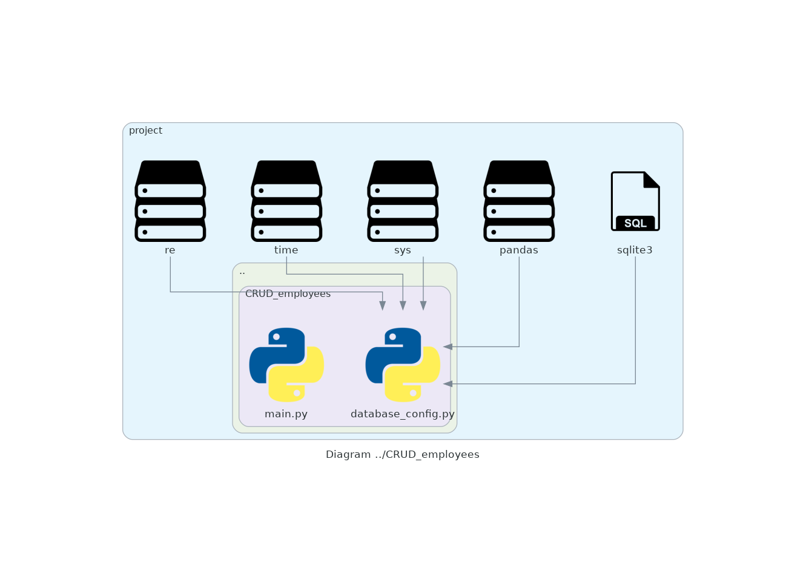

# Automatic architecture mockup

This is a program that allows creating a mockup of a project code.

---

Until now, the project is able to extract all imports in the files Python and build a diagram with the imports of the files.

For example:



---

## How does it use?

In the file [`main.py`](./main.py) you must put the path of the project, and write the path into the project to ignore

For example:

```Python
def main():
    # Project path
    project = "../My_project"

    # Paths to ignore
    ignores = ["venv", "__pycache__", ".vscode"]
    ...
```
